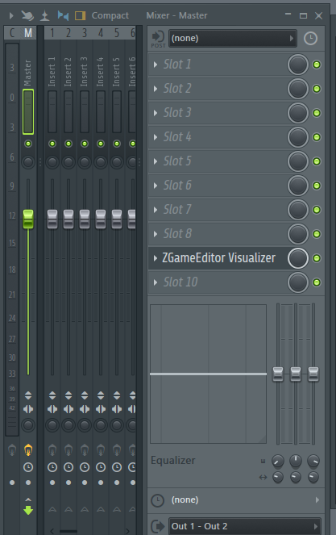
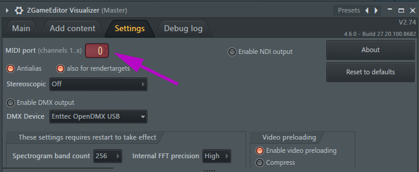
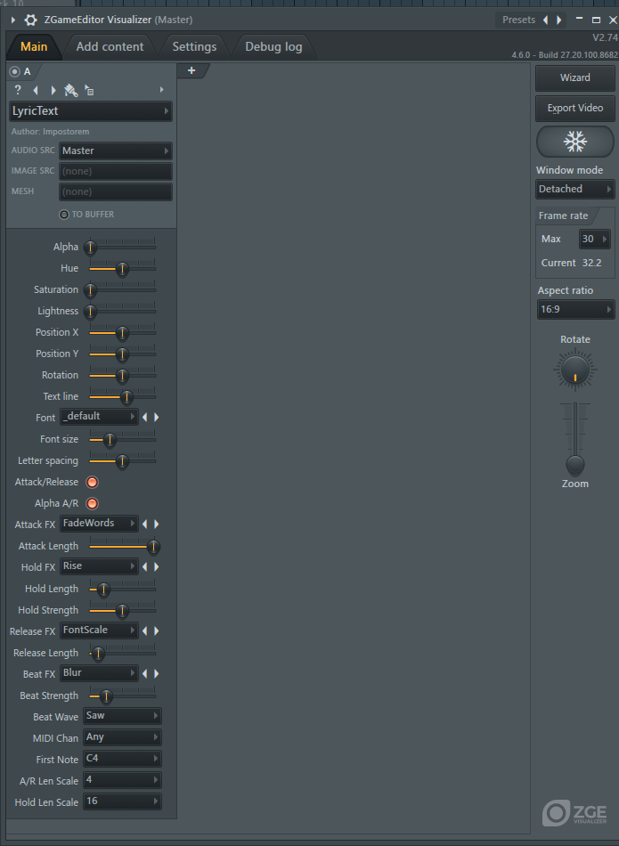
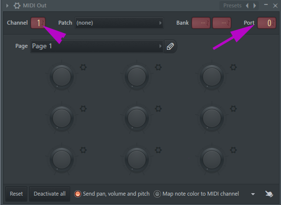
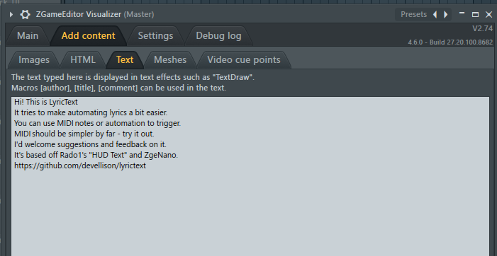
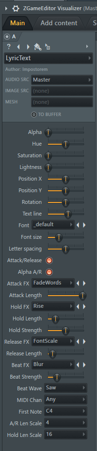

# LyricText
LyricText is an effect for the [FL Studio](http://image-line.com) / [ZGameEditor](https://github.com/VilleKrumlinde/zgameeditor " ZGameEditor") Visualizer plugin to
simplify displaying lyrics in videos.

- [Overview](#Overview)
- [Effects](#Effects)
- [Setup](#Setup)
- [Controls](#Controls)
- [Samples](#Samples)

## Overview
LyricText is based off Rado1's HUD Text and uses his [ZgeNanoVG](https://github.com/Rado-1/ZgeNano) library. 

To display lyrics, first fill the "Add content->Text" tab with your lyrics.  
Then you can select the line either by sending MIDI notes to the visualizer, or by automating the "Text Line" parameter.

It uses an Attack/Hold/Release model, and each state can have its own effect and time.

If automating with MIDI, an attack starts when a note is received and lasts for the time specified by the
"Attack Length" parameter.  It will remain in a "Hold" state until the note is release, then transitions to "Release" and
finally ends.  

These lengths are percentages of some multiple of beats, as set by the "A/R Len Scale" and "Hold Len Scale".
For instance, if the "A/R Len Scale" is 4, then the "Attack Length" and "Release Length" controls are percentages of 4 beats.
An 0.25 "Attack Length" with an "A/R Len Scale" of 4 would mean the attack will take 1 beat.

When automating via Text Line, the "Hold" state length is entirely controlled by the "Hold Length" and "Hold Len Scale" parameters instead
of the MIDI note being held.

On top of the Attack/Hold/Release effects, the Beat FX will be applied if one is selected.

## <a name="Effects"/>Effects

These are the effects that have been implemented so far...

Effect Name | Phases Supported      |Description
------------|--------------------------------
None        | All                   | Does nothing but display text
Fade        | Attack/Release/Beat   | Alpha fades the text (fades in / fades out / fades to the beat)
Blur        | Attack/Release/Beat   | Blurs the text (focuses / blurs / blurs to the beat)
Expander    | Attack/Release/Beat   | Expands the letter spacing ( contracts in / expands out / expands to the beat)
Vertical    | Attack/Release        | Slides Vertically  clipping the text (Slides up in / Slides down out )
HorzSlide   | Attack/Release        | Slides Horizontally clipping the text (Slides in from right / Slides out to right)
FontScale   | Attack/Release/Beat   | Zooms the font size (expands in / shrinks out / sizes to beat)
Rise        | Hold                  | Text slowly rises
Wander      | Hold                  | Text wanders around
Typewriter  | Attack/Release        | Text appears/disappears one character at a time
FadeWords   | Attack/Release        | Text appears one word at a time* - Work in progress
  

## <a name="Setup"/>Setup
1. Download `LyricText.zgeobject` and place it in the `Effects/Text` directory for ZGameEditor Visualizer in FL Studio.
    - On Windows, that will usually be `C:\Program Files (x86)\Image-Line\FL Studio\Plugins\Fruity\Effects\ZGameEditor Visualizer\Effects\Text`.
    See more information in the  [FL Studio manual.](https://www.image-line.com/fl-studio-learning/fl-studio-online-manual/html/plugins/ZGameEditor%20Visualizer.htm#ZGE_addfx "FL Studio manual.")

1. Add the ZGameEditor Visualizer to a mixer track (I generally put it on the Master track before any limiters)

    

2. Make sure that ZGameEditor Visualizer is accepting MIDI on a MIDI Port. Remember which port you set it to.

    

3. Add a "LyricText" Layer on the main tab of ZGameEditor Visualizer.

    

4. Set a channel up to send MIDI to Port 0 (or whichever you picked in step #2).
    - You could send patterns to a MIDI Out plugin, and set it to the appropriate port and channel you wish to send.    

        

5. Type or paste your lyrics into the "Add content->Text" tab.

                    

[See the FL Studio manual for general ZGameEditor Visualizer Settings and use.](https://www.image-line.com/fl-studio-learning/fl-studio-online-manual/html/plugins/ZGameEditor%20Visualizer.htm)

### <a name="Controls"/>Controls

Control         | Description
----------------|-----------
Alpha           | Base alpha blend value for lyric text color
Hue             | Hue for lyric text color
Saturation      | Saturation for lyric text color
Lightness       | Lightness for lyric text color
Position X      | X Position to display text.  Text is rendered centered on this point.
Position Y      | Y Position to display text. Text is rendered centered at this point.
Rotation        | 2D Rotation of text
Text Line       | The current line of they lyrics in Add Content->Text to display. Is automatically automated by MIDI notes if enabled.
Font            | Font to use for lyric text - these are pulled from the Effects/ZGameEditor Visualizer/Effects/HUD/fonts/ directory.
Font Size       | Base font size to use for lyric text
Letter Spacing  | Base letter spacing to use for lyric text - 0.5 is "normal"
Attack/Release  | If enabled, turns on the Attack and Release effects.
Alpha A/R       | If enabled, alpha fading is done in addition to the selected effects for Attack and Release
Attack FX       | Determines which Attack effect to use.
Attack Length   | Determines the length of attack effect. (Attack Length)*(Number of beats specified by "A/R Len Scale")
Hold FX         | Determines which Hold effect to use
Hold Length     | When triggered by direct automation of Text Line, determines how long the text line is "held". MIDI notes mostly override this, although it may determine speed of progression of some Hold effects. (Hold Length)*(Number of beats specified by "Hold Len Scale")
Hold Strength   | The Strength of the Hold effect.  For example, how much "Wander" and "Rise" move per frame.
Release FX      | Determines which Release effect to use.
Release LEngth  | Determines the length of Release effect. (Release Length)*(Number of beats specified by "A/R Len Scale")
Beat FX         | Determines which effect is used on top of other effects synchronized to the beat.
Beat Strength   | The Strength of the Beat effect. For example, how much "Blur" blurs the text during a beat.
Beat Wave       | Beats go from 0 to 1.0, then start back at 0. This is the Saw wave.  The effects can be modified by changing the wave form - Sin() for example will make it a smooth pulse.
MIDI Chan       | The MIDI channel(s) that Lyric Text will watch for automation
First Note      | This is the first note that will trigger the first lyric.  If you have many lyrics, you may need to lower this - 128 max with First Note at C0.
A/R Len Scale   | Scales the length of the Attack and Release effects by the specified number of beats.
Hold Len Scale  | Scales the length of the Hold effect by the specified number of beats.

### <a name="Samples"/>Samples:
Currently the main sample is in the LyricText_Test.flp project included in the repository._